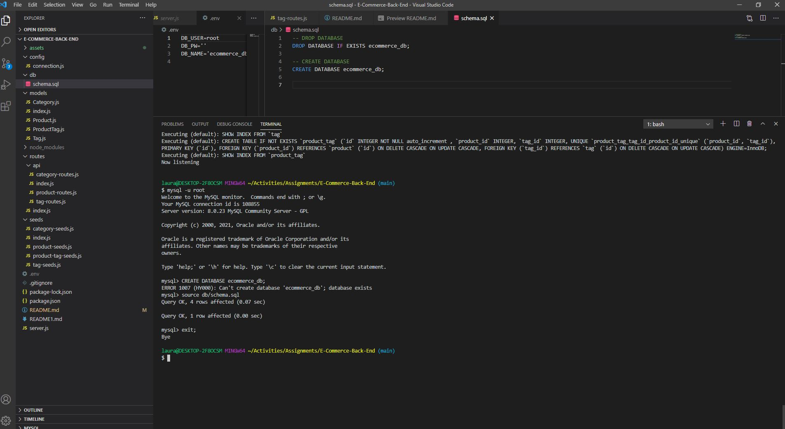

#  E-Commerce Backend (Object-Relational Mapping)
  

  ## Description
  This project is the creation of the back end for an e-commerce site. This application used Express.js API and Sequelize to interact with a MySQL database. This application displays creation of database using mySQL with models and associations. Then demonstrates the API Routes to perform RESTful CRUD operations displayed in my walk through videos.

## Table of Content
- [Installation](#installation)
- [Usage](#usage)
- [License](#license)
- [Contributing](#contributing)
- [Test](#Test)
- [Questions](#questions)

## Installation
  The user should clone the repository from GitHub. This application requires Node.js, Express.js, and Sequelize. To connect to the database run mysql -u root and. Then source the schema.sql. To seed the file run npm run seed. Finally to connect to the server run npm start.

## Usage
  This application will allow users to view, add, edit, and delete categories, products, and tags.

 - The walkthrough video that demonstrates the functionality of the e-commerce back end must be submitted, and a link to the video should be included in your readme file.
 [screencastify](https://drive.google.com/file/d/1gf2epBy3cymw7bmWKdcUH3LKF1q66Ebr/view)
 

- The walkthrough video must show all of the technical acceptance criteria being met.
 [screencastify](https://drive.google.com/file/d/1UYFdtSZW1vO3_ae-mjXx-0GExOyU6vH8/view)
 

 - The walkthrough video must demonstrate how to create the schema from the MySQL shell.
 [screencastify](https://drive.google.com/file/d/1i4S81dNx-0hBoYBY3xdgUqdoDQAaqqPe/view)     
 
 

 - The walkthrough video must demonstrate how to seed the database from the command line.
 [screencastify](https://drive.google.com/file/d/1lWPT-b6l9S8cxE9kKs39KjyDG22OAKOH/view)
 

 - The walkthrough video must demonstrate how to start the application’s server.
 [screencastify](https://drive.google.com/file/d/1ExtA0Ep84mGfBQTz2bipQbmXEM-yzeCF/view)
 

 - The walkthrough video must demonstrate GET routes for all categories, all products, and all tags being tested in Postman.
 [screencastify](https://drive.google.com/file/d/1wZ6Pz1_2-s7_4MlccBRTrRl0pw2E7xaq/view)
 

 - The walkthrough video must demonstrate GET routes for a single category, a single product, and a single tag being tested in Postman.
 [screencastify](https://drive.google.com/file/d/1FtwdbfBzOq9vy3XjWFbs79nxctPPRiXS/view)
 

 - The walkthrough video must demonstrate POST, PUT, and DELETE routes for categories, products, and tags being tested in Postman.
 [screencastify](https://drive.google.com/file/d/1sX1V54l7WBT3CCbgVsbmsQUdy3ROmRr9/view)
 

 - Link the application deployed on [Heroku](https://secure-refuge-38446.herokuapp.com/)

## License
    This application is covered by the MIT license.

## Contributing
  Any cntribution is welcome.

## Test
  There are no tests for this application.

## Questions
If you have any question, Email me at: lauracejas9412@gmail.com 
  
  Find me on GitHub: [Lauracejas](https://github.com/Lauracejas)   
  
  ---

  _This README was generated with ❤️ by [README-generator](https://github.com/Lauracejas/Professional-README-Generator) © 2021_

